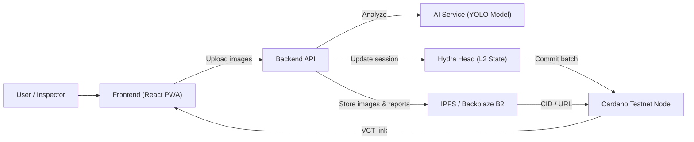

# HydraAI Inspect

AI-Powered Vehicle Inspection & Fast Tokenization Layer on [Cardano](https://cardano.org/),
using [Hydra](https://hydra.family/head-protocol/) as a high-throughput Layer 2 for inspection workflows.

## Monorepo Structure

- `frontend/` – React PWA for inspectors and users
- `backend/` – Node.js / TypeScript API
- `ai-service/` – Python AI microservice (YOLO-based damage detection)
- `hydra/` – Hydra Head configs & scripts
- `infra/` – Docker, docker-compose, and optional k8s manifests
- `docs/` – Architecture, setup guides, and Catalyst proposal

## High-Level Components



- **Frontend (React PWA)** – Uploads vehicle photos, previews AI outputs & inspection status, and exposes Vehicle Condition Token (VCT) links/QR codes.
- **Backend API (Node.js/TS)** – Coordinates the inspection workflow, calls the AI service, talks to the Hydra Head for off-chain session state, triggers CIP-68 minting on Cardano testnet, and pushes images/reports to IPFS/B2.
- **AI Service (Python)** – Provides a REST endpoint (e.g., `/analyze`) that accepts images and responds with damage type, bounding boxes, confidence, and an overall condition score.
- **Hydra Head Cluster** – Maintains the off-chain inspection session (status, AI results, inspector approvals) and batches transactions before committing them to Cardano L1.
- **Cardano Node (Testnet)** – Mints CIP-68 Vehicle Condition Tokens, persisting the final metadata hash plus the IPFS/B2 references.
- **Storage (IPFS / Backblaze)** – Stores the raw vehicle photos and the JSON inspection reports; the resulting CID/URL is embedded inside the minted token metadata.

## Quickstart (Dev)

```bash
# 1. Clone repo
git clone https://github.com/Sumbu-Labs/HydraAI-Inspect.git
cd HydraAI-Inspect

# 2. Start services (dev)
docker compose -f infra/docker-compose.dev.yml up --build
```

More details in [docs/overview.md](docs/overview.md)

## Reference Material

- [HydraAI-Inspect Proposal (PDF)](HydraAI-Inspect-Proposal.pdf)
- [HydraAI-Inspect Pitching Deck (PDF)](HydraAI-Inspect-Pitching.pdf)
