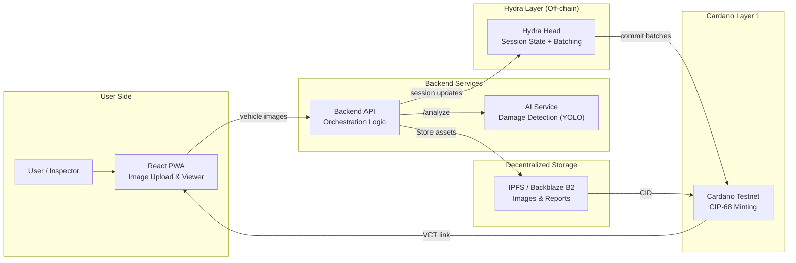

# Architecture

- **Frontend (React PWA)** – Captures photo uploads, renders AI damage details + inspection status, and shows QR/links to the Vehicle Condition Token (VCT).
- **Backend API (Fastify)** – Runs the inspection workflow: handles uploads, sends `/analyze` requests to the AI service, keeps off-chain state in Hydra, writes evidence to storage, and triggers CIP-68 minting on Cardano.
- **AI Service (FastAPI)** – Offers a REST endpoint returning damage types, bounding boxes, confidence, and the aggregated condition score per vehicle.
- **Hydra Head Cluster** – Stores the off-chain inspection session (status, AI outputs, inspector approvals) and batches transactions before committing to Cardano L1.
- **Cardano Node (Testnet)** – Executes CIP-68 mints for the VCT and records metadata hashes plus the IPFS/B2 links.
- **Storage (IPFS / Backblaze B2)** – Preserves raw photos and inspection report JSON. The resulting CID/URL is embedded inside the on-chain metadata.
